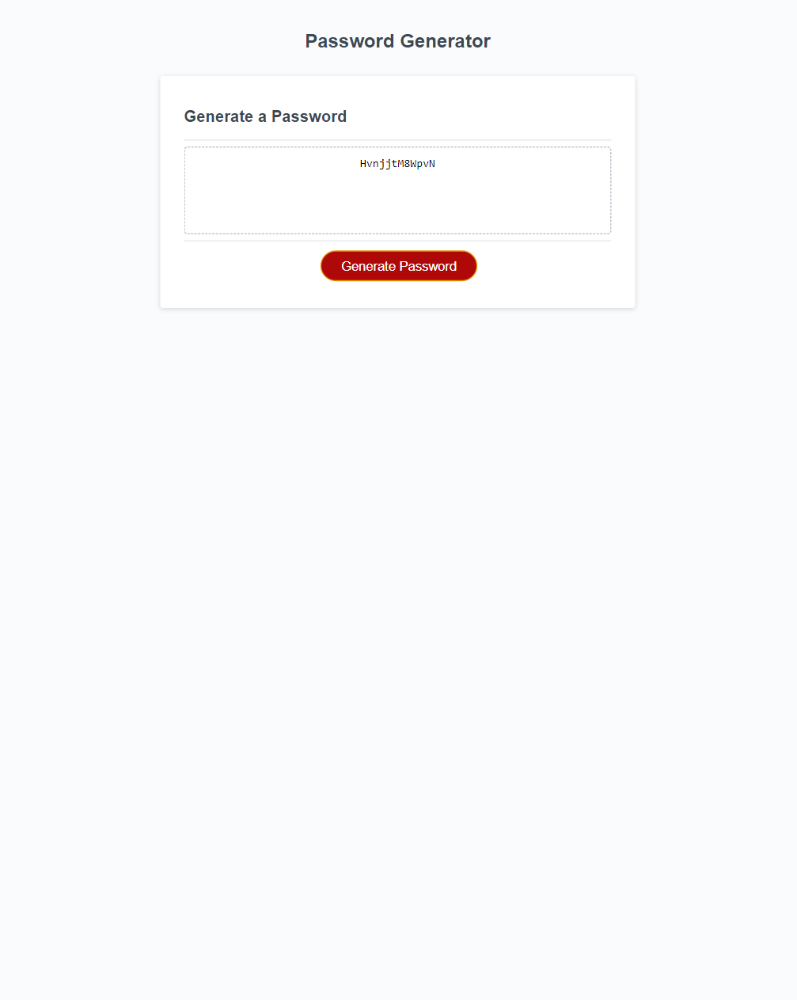

# Random Password Generator

## Decription
    This is a password generator. It generates passwords.

## Functionality
    Step 1: Click generate button
    Step 2: Answer prompts about password composition
    Step 3: Profit
## Technology
    Languanges used are:
    - HTML
    - CSS
    - Javascript
## Screenshot

## Credits
@Damien Cantrell for helping me build this for loop using math.random and math.floor.
this was discussed in a private conversation via discord and i cannot link the source.

lines 35-38 in the .js file
"``` for (var index = 0; index < characterlength; index++) {
       var randomLetter = Math.floor(Math.random() * choiceArray.length);
       password = password + choiceArray[randomLetter];
  }
  ```"


